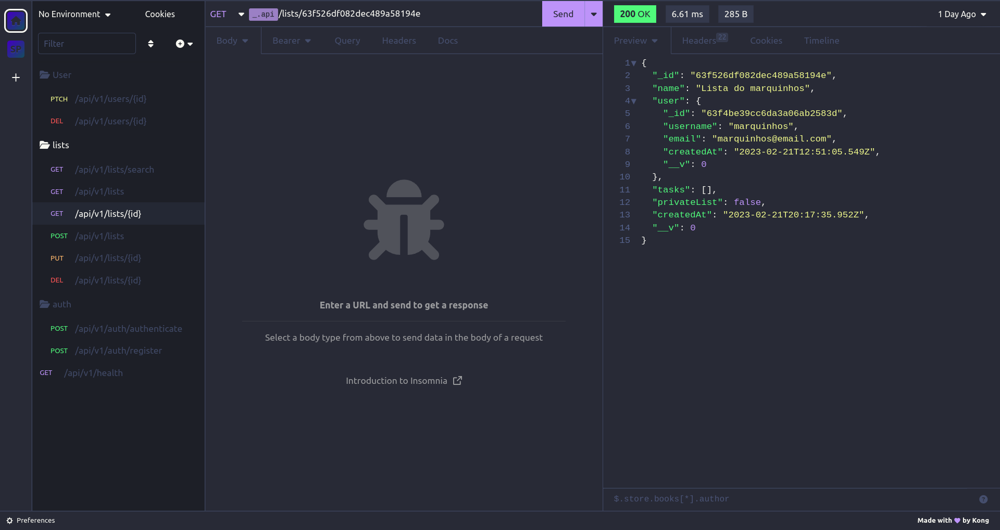

# todo-app-backend

**NOTA:** Esse é o meu primeiro projeto com Front-End e Back-End, então tenho muito carinho por ele.  

Mesmo tendo me esforçado bastante eu sei que ele não tem o melhor código do mundo, pois comecei faz pouco tempo, mas o foco é aprender mais e MAIS!

## Sumário

* [O Que Aprendi](#o-que-aprendi)
* [Sobre o Projeto](#sobre-o-projeto)
  * [Objetivos e Ideias do Projeto](#objetivos-e-ideias-do-projeto)
  * [Tecnologias](#tecnologias)
  * [Configurando o Projeto](#configurando-o-projeto)
  * [Executando o Projeto](#executando-o-projeto)
  * [Monitorando os Logs](#monitorando-os-logs)
  * [Front-End](#front-end)
* [Miscelânea](#miscelania)
* [Autor](#autor)

## O Que Aprendi

Nesse projeto consegui entender muita coisa que eu ainda tinha duvida, aprimorei os meus
conhecimentos em tecnologias que já usava e também adquiri novos aprendizados.
Mas com toda certeza, o maior destaque desse projeto para mim foi o [Docker](https://www.docker.com), essa ferramenta é incrível e todos deveriam usá-la.

Eu aprendi a usar o Docker para containerizar os serviços, automatizar o processo de build e execução do projeto, entendi melhor como funcionam as variáveis de ambiente no Docker e como o [NodeJS](https://nodejs.org) utiliza elas.

Lendo artigos e documentações eu descobri que executar um container da imagem do NodeJS usando o usuário root é uma falha de segurança, então eu tive um cuidado a mais na hora de escrever a [Dockerfile](https://github.com/sx1n/todo-app-backend/blob/main/Dockerfile), mesmo que o projeto talvez não vá para a produção foi interessante adotar essa contra-medida, segurança e conhecimento nunca são demais.

E saindo um pouco do Docker, eu entendi a importância de uma padronização de código no projeto, então eu adicionei um boilerplate com: Configurações básicas do ESLint, um arquivo de configuração do editor para ajudar a desenvolver o projeto com padrões e também um arquivo [.gitattributes](https://github.com/sx1n/todo-app-backend/blob/main/.gitattributes) para corrigir/formatar arquivos que serão commitados para o repositorio. Unindo todas as citadas, o projeto consegue ter um código mais organizado

Agora para dentro do Código, eu consegui evoluir na parte de Tratamentos de erros da API com o [express](https://expressjs.com) e também na parte de realizar um CRUD mais avançado com relacionamentos no [MongoDB](https://www.mongodb.com) utilizando o [Mongoose](https://mongoosejs.com). E tudo isso implica num servidor com um middleware que consegue capturar todos os erros que poderão ter na aplicação, evitando que o programa feche devido a algum erro inesperado na execução
e em uma API REST mais resiliente.

## Sobre o Projeto

### Objetivos e Ideias do Projeto

O Objetivo do projeto era adquirir uma visão geral de como funciona uma aplicação por completo, então eu queria desenvolver algo que não seja TÃO SIMPLES e nem MUITO COMPLEXO para que eu consiga treinar construção de layout com Flex e Grid no HTML e CSS, Consumo e construção de uma API, Manipular melhor a DOM, Autenticação no Back-End e no Front-End, Docker, algum banco de dados não relacional e o melhor de tudo, me divertir aprendendo

Até o momento atual só está pronto o Back-End desse projeto, então aos poucos eu vou desenvolvendo o Front-End.

A fazeres:

* [x] Me Divertir Aprendendo
* [x] Construir uma API REST
* [x] Autenticar no Back-End
* [x] Aprender Docker
* [x] Usar um Banco noSQL
* [ ] Treinar Layout com Flex e Grid
* [ ] Treinar Manipulamento da DOM
* [ ] Aprender a Autenticar no Front-End
* [ ] Aprimorar a Forma de Consumir APIs REST no Front-End

A ideia do Projeto é basicamente desenvolver uma aplicação que um Usuário pode ter várias Listas de Tarefas e que uma Lista de Tarefas pode ter várias Tarefas

**Detalhe:** As Listas de Tarefas podem ser privadas ou públicas e as Tarefas podem estar completas ou não

### Tecnologias

* [NodeJS](https://nodejs.org)
* [Express Framework](https://expressjs.com/)
* [Mongoose ODM](https://mongoosejs.com)
* [MongoDB](https://www.mongodb.com)
* [Docker](https://www.docker.com)

### Configurando o Projeto

1. Primeiramente abra seu terminal e clone o repositório do projeto  

```bash
git clone https://github.com/sx1n/todo-app-backend.git
```  

2. Depois que clonar, será criado um diretório chamado `todo-app-backend` e é nele que o projeto vai estar, entre nele  

```bash
cd todo-app-backend
```  
  
3. Agora você precisa criar um Arquivo `.env` na raiz do projeto e configurá-lo, as configurações estarão dentro do arquivo `.env.example`, então é só copiar e colar.  

Crie o arquivo `.env`

```bash
touch .env
```

Agora insira isso dentro dele:

```bash
NODE_ENV=development

# SERVER
SERVER_PORT=3000
SERVER_HOST=0.0.0.0

# DB
DB_USER=todo_app_user
DB_PASS=todo_app_password
DB_HOST=app_mongodb
DB_PORT=27017
DB_NAME=todo_app

# JWT
JWT_SECRET=111512e7ea4572778a9b46cc64608bf1
JWT_EXPIRATION=1d

# BCRYPT
BCRYPT_SALT=13
```  

**OBS: Se você for experiente, pode alterar os valores dessas variáveis**  
  
### Executando o Projeto

**NOTA**: Esse projeto foi feito para executar dentro do Docker  
**NOTA2**: Essa API foi feita para ser consumida pelo Front-End

Então depois de configurado, você vai buildar a rede de containers do projeto  

```bash
docker compose build
```  
  
Depois de buildar é só inicializar os containers com a flag `-d` para usar o modo detach e você conseguir usar o terminal depois  

```bash
docker compose up -d
```
  
Perfeito, agora o projeto está funcionando localmente na sua Máquina, acesse <http://localhost:3000/api/v1/health> para ver se está tudo OK  

### Monitorando os Logs

Caso você queira monitorar os Logs do NodeJs

```docker
docker logs -f app_nodejs
```
  
### Front-End

O Front-end Ainda não está pronto, mas assim que ele estiver, esse README terá o link para o repositório do mesmo

## Miscelânea

Você pode debugar a API e/ou utilizar ela através [Insomnia](https://insomnia.rest/)

é só importar o [arquivo de configuração](https://github.com/sx1n/todo-app-backend/blob/main/Insomnia_2023-02-23.yaml) do Insomnia e você visualizará os endpoints da API



## Autor

[Samuel Laurindo](https://github.com/sx1n/)
